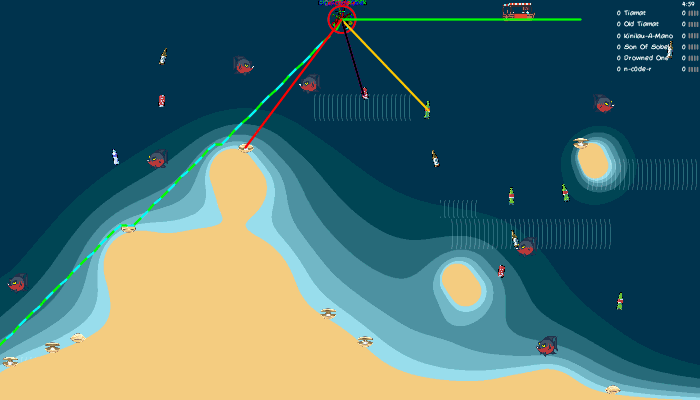

# GameAI
Programming a AI to play and collect pearls in a diving game tournament

For "AI for Games" class we got a very basic diving game given by our professor and were "only" supposed to program an AI to collect pearls scattered around on the playfield in a tournament setting (extra points for fast AIs, but those don't count towards the grade, just prestige and bragging rights). No other changes to the game were done, as we weren't supposed to "make a game", just the AI to play it. We expanded the AI step by step as we learned the concepts in the lectures.

I left the debugging drawings in the GIF so you can see the weird choices each AI diver makes. They are all from different development stages and behave differently. Funny, the "latest" (yellow) is often slower, but (given the right map) much safer and wouldn't drown fast - but wouldn't win a tournament's first place that way.

PS:
This project still has many issues to fix. Can't wait to tackle them with more time and hopefully even more professionally then, too.
